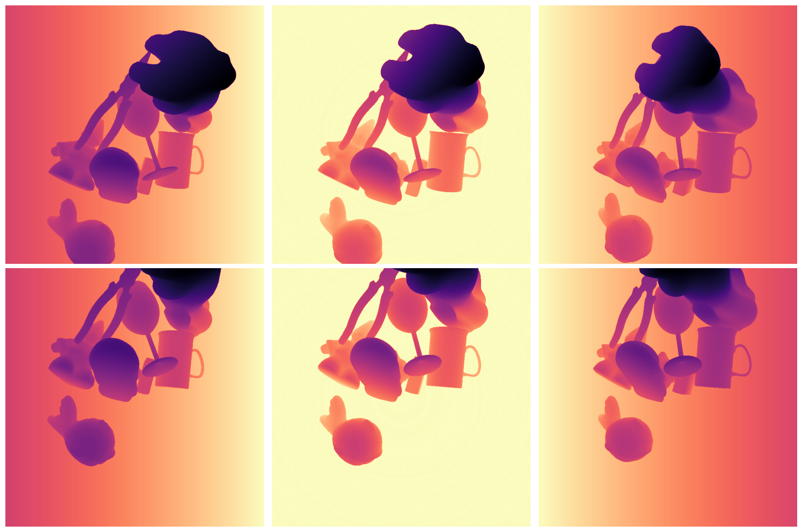

# ToteMVS: A Multi-Material MVS Dataset

  
  
    

 

The data set includes;
- 450 scenes with six camera angles each (see below)
- Ground-truth depth
- Instance + material segmentation
- Camera intrinsic / extrinsics

## More Samples

``